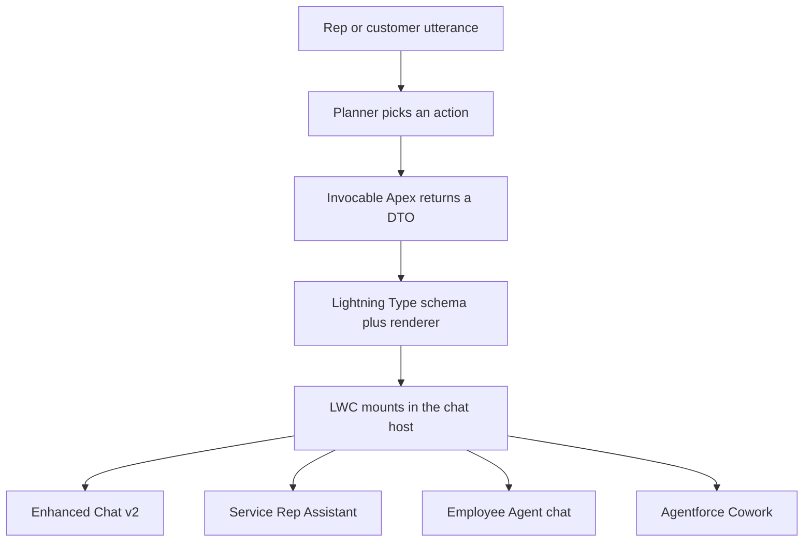

# How Custom Lightning Types work

This is the field-tested model for **Apex-based** Custom Lightning Types (CLTs) on Agentforce chat surfaces. It is the contract `sf-clt-builder` generates and `agentforce-lightning-types` debugs.

A CLT card **renders** on Enhanced Chat v2, Service Rep Assistant, Employee Agent chat, and Agentforce Cowork. Write-back (buttons talking to the host) is per-surface and is documented separately below.

Salesforce's published channel table is [Lightning Type UI Configuration](https://developer.salesforce.com/docs/platform/lightning-types/guide/lightning-types-ui-config.html). Everything below that table — envelope, display flags, ShowCommand, SRA write-back — is what you need in a working org that the compatibility table does not spell out.

---

## 1. What a CLT is

An Agentforce action can return structured data. Without a Lightning Type, the planner **narrates** that data as chat text. With a Lightning Type, the host **mounts an LWC** and passes the Apex payload in as `@api value`.

**Cards render on all four Agentforce chat surfaces.** One envelope (`lightningDesktopGenAi` renderer + `lightning__AgentforceOutput` LWC) is what the host mounts. The surfaces are:

| Surface | Who sees the card |
|---------|-------------------|
| **Enhanced Chat v2** | External customer in the web chat widget |
| **Service Rep Assistant** | Service rep in the LEX / Service Console panel |
| **Employee Agent chat** | Internal user in the LEX Employee Agent panel |
| **Agentforce Cowork** | Internal user in Cowork |

Write-back (a button talking back to the host) is a separate, surface-specific layer. See [section 5](#5-surfaces--cards-render-everywhere-write-back-does-not).



The LWC is not on a record page. It is a renderer inside the Agentforce host. That is why its `js-meta.xml` targets `lightning__AgentforceOutput` (and `lightning__AgentforceInput` if it also collects input) and **not** `lightning__RecordPage`.

---

## 2. Four artifacts, four names

These do not match by coincidence. Each file **points at** the next. Get any join wrong and the card is invisible — usually with no error.

Using a technician-appointment picker as the example:

| Artifact | Convention | Example | Who points at it |
|----------|------------|---------|------------------|
| Apex DTO class | PascalCase, `global` | `SummitRidgeAppointmentSlotsOutput` | Lightning Type `schema.json` → `@apexClassType/c__SummitRidgeAppointmentSlotsOutput` |
| Lightning Type folder | camelCase | `summitRidgeAppointmentSlotsOutput` | GenAiFunction output → `lightning:type` `c__summitRidgeAppointmentSlotsOutput` |
| LWC | camelCase, `*Card` | `summitRidgeAppointmentCard` | `renderer.json` → `c/summitRidgeAppointmentCard` |
| JSON field on the DTO | `*JSON` | `slotsJSON` | LWC reads `this.value.slotsJSON` |

### File layout

```
force-app/main/default/
  classes/
    SummitRidgeAppointmentSlotsOutput.cls
    SummitRidgeGetAppointmentSlotsAction.cls
  lightningTypes/summitRidgeAppointmentSlotsOutput/
    summitRidgeAppointmentSlotsOutput.lightningType-meta.xml
    schema.json
    lightningDesktopGenAi/
      renderer.json          ← ONLY this channel folder by default
  lwc/summitRidgeAppointmentCard/
    summitRidgeAppointmentCard.js
    summitRidgeAppointmentCard.html
    summitRidgeAppointmentCard.js-meta.xml
  genAiFunctions/Summit_Ridge_Get_Appointment_Slots/
    ...
```

`renderer.json` must wrap the override:

```json
{
  "renderer": {
    "componentOverrides": {
      "$": {
        "definition": "c/summitRidgeAppointmentCard"
      }
    }
  }
}
```

On API 67.0, omitting the `"renderer"` wrapper fails deploy with `additionalProperties`. Generate **only** `lightningDesktopGenAi/`. Do not add `enhancedWebChat/` — the compatibility table lists it as valid, and Enhanced Chat v2 **falls back** to the desktop renderer when it is missing, but adding that folder has overridden working desktop configs in field testing.

---

## 3. The JSON-string envelope

The DTO is a tiny `global` class with **one** `@AuraEnabled` String that holds stringified JSON. The LWC parses it. Do not bind lists with `sourceType` / `lightning__listType` on the renderer LWC — that path has broken renderer registration.

```apex
@JsonAccess(serializable='always' deserializable='always')
global class SummitRidgeAppointmentSlotsOutput {
    @AuraEnabled global String slotsJSON;
    global SummitRidgeAppointmentSlotsOutput(String j) { this.slotsJSON = j; }
    global SummitRidgeAppointmentSlotsOutput() { this.slotsJSON = ''; }
}
```

```javascript
@api value;

connectedCallback() {
    const raw = this.value.slotsJSON;
    const parsed = typeof raw === 'string' ? JSON.parse(raw) : raw;
    this.slots = parsed.slots || [];
}
```

Action `Response` fields use `@InvocableVariable`. The displayable field is typed as the **DTO class**, always populated (use a sentinel `{"error":"..."}` on failure). Pair it with 2–3 scalar passthroughs the planner can read.

**Display flags are two independent switches:**

| Field | Card / DTO | Planner passthroughs |
|-------|------------|----------------------|
| Path A `isDisplayable` | `true` | `false` |
| Path A `isUsedByPlanner` | `false` | `true` |
| Path B `is_displayable` | `True` | inverse |
| Path B `filter_from_agent` | `True` on the JSON | so the planner does not narrate it |

`isDisplayable` is what gates the render tool. Filtering the JSON is what stops the model from reading the card aloud.

---

## 4. The planner has to *show* the card

Authoring the bundle is not enough. The planner chooses **ShowCommand** (mount the LWC) or **InformCommand** (speak the result). Vague topic instructions produce `InformCommand` with `result: []`. The LWC never mounts.

Put `show_command` language in **three** places:

1. The `@InvocableMethod` description
2. The Lightning Type `schema.json` `description`
3. One topic instruction

Keep topic instructions otherwise short. Diagnose in the browser Network tab on `messages/stream`: if you see `result: []`, it was InformCommand. Switch the console context to the Agentforce Messaging **iframe** before you look.

---

## 5. Surfaces — cards render everywhere; write-back does not

The same CLT **shows up** on Enhanced Chat v2, Service Rep Assistant, Employee Agent chat, and Agentforce Cowork. The Apex envelope does not change.

What **is** per-surface: the write-back API (if any), sharing, and the run-as user. A button wired to one host is silent on the others. Do not confuse “the card did not render” with “the button did nothing.”

| Surface | Channel folder | Write-back | Run-as |
|---------|----------------|------------|--------|
| **Enhanced Chat v2** | same; do **not** add `enhancedWebChat/` | `this.configuration?.util.sendTextMessage(...)` | portal user or botUser — permset the user the session actually runs as |
| **Service Rep Assistant** (LEX panel, actions execute) | `lightningDesktopGenAi` only | `copytochat` / `acc:execute` (undocumented). Customer send via `lightning/conversationToolkitApi` | `without sharing`; permset on EinsteinServiceAgent **and** the rep |
| **Employee Agent chat** (LEX panel) | same | `execute(utterance, botId)` from `lightning/accApi` (documented). Do not assume `copytochat` works | logged-in user; `with sharing` unless proven otherwise |
| **Agentforce Cowork** | same envelope; card **does** render | **None verified** for write-back. Display-only or `NavigationMixin` | logged-in user |

Confirm you are on the Agentforce agent in the LEX panel (topics whose actions **execute**), not the Case-page Service Assistant component (actions there are grounding only).

**Privacy:** if `enhancedWebChat` is not configured, Enhanced Chat v2 uses `lightningDesktopGenAi`. A rep card can therefore render to an external customer. Strip internal fields, or ship a second customer-safe type. Missing `enhancedWebChat/` is not an opt-out.

---

## 6. SRA chat write-back

This is the piece people notice in a demo: the rep picks a slot on the card, and an utterance appears in the SRA panel as if they typed it.

Salesforce documents one CLT renderer-to-host hook (`getFormattedValue()`). The SRA panel additionally listens for two bubbling, composed DOM events. They are **verified empirically** in that panel and are **not in Salesforce reference docs**. Treat them as undocumented.

| Event | What the panel does | Use when |
|-------|---------------------|----------|
| `acc:execute` | Auto-sends the string into chat history. The planner runs immediately. | Decisive next steps: book this window, run the line test, restart the gateway |
| `copytochat` | Drops the string into the chat **input box**. The rep edits, then sends. | Anything customer-facing a human should review first |

```javascript
handleBook() {
    const message =
        `Book a Summit Ridge technician visit for this customer on ${s.isoDate} ` +
        `during the ${s.window} window (${s.windowLabel}).`;

    this.dispatchEvent(new CustomEvent('acc:execute', {
        detail: { content: message },
        bubbles: true,
        composed: true
    }));
}
```

### Contract — miss any of these and it silently no-ops

1. Fire **exactly one** event name. `"copytochat/acc:execute"` does nothing.
2. Payload is `detail: { content: '<string>' }` — not `detail.text`.
3. Both `bubbles: true` and `composed: true`, so the event crosses shadow DOM to the panel listener.
4. Host is the **SRA panel**, with Service Assistant in **Dynamic Plan** mode. The standard Agentforce / ACC panel ignores these events.

Word the utterance so the planner can extract action inputs. For booking, that means an ISO date (`yyyy-MM-dd`) and `Morning` / `Afternoon` in the sentence — not just “Thursday afternoon.”

Because the card posts the next utterance itself, this also sidesteps a known planner gap: after a Confirm on a write action, the chain sometimes does not resume. The button does not wait for that resume.

### Two different destinations

Do not mix these up.

| Destination | API | Who receives it |
|-------------|-----|-----------------|
| **Assistant** | `acc:execute` / `copytochat` | The SRA planner, as a rep utterance |
| **Customer** | `lightning/conversationToolkitApi` (`sendTextMessage` / `setAgentInput`) | The live Messaging Session / Case conversation |

Customer send must resolve from the **focused console tab** (Messaging `0Mw`, Case `500`, Voice `0LQ`), not from “most recent Active MessagingSession” in Apex. That ladder is fine for **reads**. It is not safe for **sends** in an org with several active sessions.

`sendTextMessage` success is `!== false`. The method can resolve `undefined` while still delivering. A strict `=== true` check treats a successful send as a failure. Once a messaging or Case target was attempted, do not also `copytochat` the same text into the agent panel — a later retry would duplicate it.

Employee LEX uses `lightning/accApi`. Enhanced Chat v2 uses `this.configuration.util`. Neither module exists in the SRA host, and the SRA events do not exist on those hosts. To share one renderer, branch at runtime: `this.configuration?.util` first, then SRA events, else no-op. The interactive LWC template in `sf-clt-builder` does that.

---

## 7. Deploy to an org

Path A (Agentforce Builder + `GenAiFunction` metadata), which is what the Summit Ridge reference uses:

1. Deploy DTO, Lightning Type bundle, LWC, Invocable, permset.
2. **Deactivate** the agent.
3. Deploy / rebuild the `GenAiFunction` and planner bundle (actions created in the **Asset Library**, then added to the topic — not created inside the subagent UI).
4. Grant the permset to **EinsteinServiceAgent** (`sf org assign permset --on-behalf-of <botUser>`) **and** to the demo rep.
5. Activate the agent.
6. On Enhanced Chat v2: add ECv2 as a Connection, ESD client version **WebV2**, then **republish the ESD** after every change.

Path B (Agent Script) is `sf agent validate` → `publish` → `activate`. Same envelope. Different wiring.

LWC `apiVersion` **67.0**. LightningTypeBundle floor **64.0+**. The action must return an Apex class — a bare `String` bypasses the LWC.

### Card renders as text

Walk this before rewriting schemas. Each item independently prevents rendering, and none of them throw.

1. Republish the ESD (ECv2) — cheapest fix, worth trying first.
2. ECv2 is a Connection on the agent.
3. ESD client version is WebV2, not V1.
4. Bundle deployed; LWC has `lightning__AgentforceOutput`; folder name matches the action's type.
5. Permset covers DTO, action Apex, Lightning Type, FLS, object CRUD, **and every Apex class the LWC calls**.
6. Action was created in the Asset Library, then added.
7. `isDisplayable: true` on the card output.
8. Planner emitted ShowCommand (`result` is not `[]` on `messages/stream`).
9. You tested on the real surface, not only Builder preview.

`agentforce-lightning-types` is the debug skill for that list.

---

## 8. Generate vs debug

| You want to… | Load |
|--------------|------|
| Create a new card | `sf-clt-builder` |
| Fix a card that will not render | `agentforce-lightning-types` |
| Object-schema CLTs (Experience Builder / Prompt Builder / Mosaic) | not this pack |

Verified Path A reference: eight Summit Ridge Lightning Types on Service Rep Assistant — profile, outage, line diagnostics, gateway, equipment, fiber, plan upgrade, appointment picker. The appointment card is the write-back demo beat.
